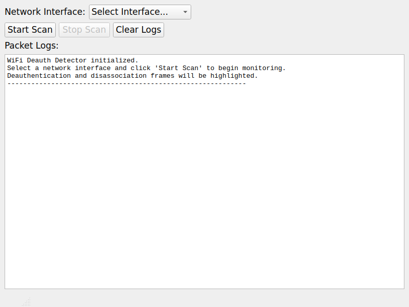

# WiFi Deauth Detector - GUI Application

A PyQt5-based GUI application for detecting WiFi deauthentication attacks on Windows.

## Features

✅ **PyQt5 Minimal UI** - Clean and user-friendly interface  
✅ **Packet Logs Display** - Real-time packet logging in QTextEdit  
✅ **Start/Stop Scanning** - Control buttons for packet capture  
✅ **Interface Selection** - Dropdown menu for network interface selection  
✅ **Status Bar** - Shows current application status  

## Requirements

- Python 3.7+
- Windows 10/11 (with Npcap installed for packet capture)
- Network adapter supporting monitor mode

## Installation

1. Clone the repository:
```bash
git clone https://github.com/vinothvbt/WiFi-Deauth-Detector-for-windows.git
cd WiFi-Deauth-Detector-for-windows
```

2. Install dependencies:
```bash
pip install -r requirements.txt
```

3. Install Npcap (Windows only):
   - Download from [https://npcap.com/#download](https://npcap.com/#download)
   - Install with "WinPcap Compatible Mode" enabled
   - Enable "Support raw 802.11 traffic" option

## Usage

### Running the Application

```bash
python wifi_deauth_detector.py
```

### GUI Components

1. **Interface Dropdown**: Select your wireless network interface
2. **Start Scan Button**: Begin monitoring for deauth frames
3. **Stop Scan Button**: Stop the monitoring process
4. **Clear Logs Button**: Clear the packet log display
5. **Packet Logs Area**: Shows detected packets and alerts
6. **Status Bar**: Displays current application status

### Testing the GUI

Run the test script to verify all components work:

```bash
python test_gui.py
```

## How It Works

1. **Interface Selection**: Choose your wireless adapter from the dropdown
2. **Packet Capture**: Uses Scapy to sniff 802.11 wireless frames
3. **Deauth Detection**: Filters for deauthentication (type=0, subtype=12) and disassociation frames
4. **Alert Display**: Shows detected attacks with source and target MAC addresses
5. **Real-time Logging**: All packet information is logged in the GUI

## Deauth Frame Detection

The application specifically looks for:
- **Deauthentication frames** (`Dot11Deauth`)
- **Disassociation frames** (`Dot11Disas`)

When detected, it extracts:
- Source MAC address (potential attacker)
- Target MAC address (victim device)
- Timestamp of the attack

## Dependencies

- `PyQt5` - GUI framework
- `scapy` - Packet capture and analysis
- `psutil` - System information (network interfaces)
- `netifaces` - Network interface enumeration

## Troubleshooting

### Common Issues

1. **"Scapy not available"**: Install scapy with `pip install scapy`
2. **"No interfaces detected"**: Run as administrator or check Npcap installation
3. **"Permission denied"**: Ensure administrator privileges for packet capture
4. **"Interface not found"**: Select a different interface from the dropdown

### Windows-Specific Notes

- Requires Npcap with raw 802.11 support
- May need administrator privileges for packet capture
- Monitor mode support depends on your wireless adapter

## GUI Screenshot

The application provides a clean, minimal interface with all required components:



## License

This project is for educational and security testing purposes only. Use responsibly and only on networks you own or have permission to test.