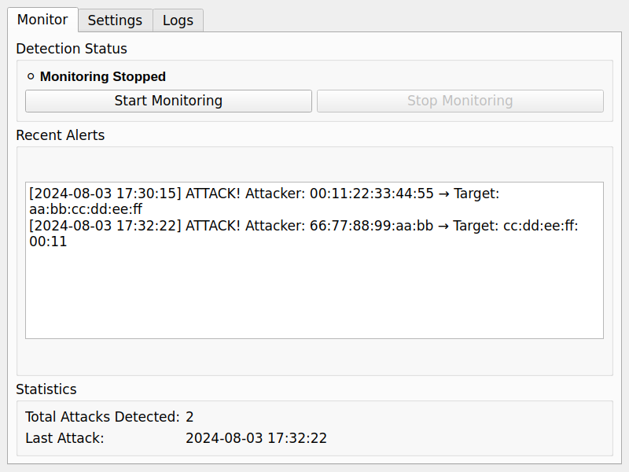
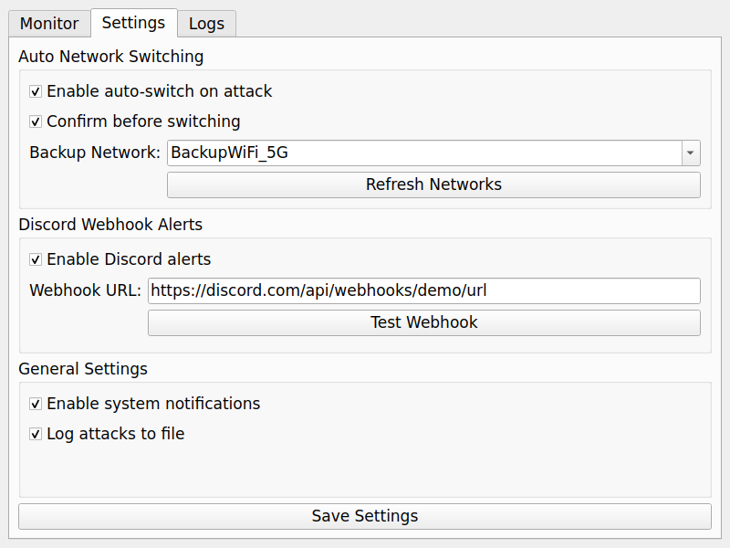
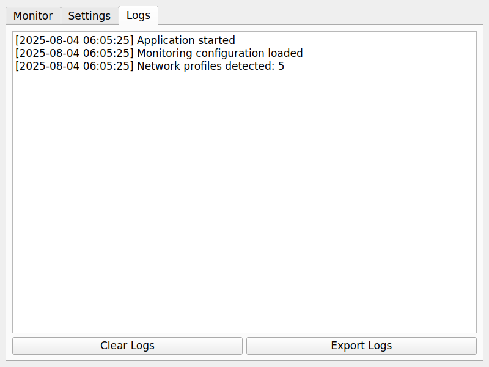

# 🛡️ WiFi Deauth Detector — Windows App v2.0.0

A lightweight real-time WiFi deauthentication attack detector for Windows. Redesigned to work on **ALL standard Windows laptops** without requiring special WiFi hardware or monitor mode. This app monitors your own WiFi connection for suspicious disconnection patterns and alerts you to potential deauth attacks.

> ✅ Works on **ANY Windows laptop** (no special hardware required)  
> ✅ **Normal mode operation** — no monitor mode needed  
> ✅ **Real-time connection monitoring** using Windows APIs  
> ✅ **AUTO-SWITCH NETWORKS** on suspicious activity detection  
> ✅ **DISCORD WEBHOOK ALERTS** with event details  
> ✅ Complete **GUI interface** with settings management

---

## ⚙️ Features

### 🚨 Core Detection
- **Real-time WiFi connection monitoring** using Windows native APIs
- **Suspicious disconnection pattern detection**
- **Self-protection focused** — monitors your own connection
- **Configurable monitoring** with start/stop controls

### 🔄 Auto Network Switching
- **Automatically switch to backup WiFi** when suspicious activity detected  
- **Configurable backup network** from available profiles
- **Optional confirmation dialog** before switching
- **Uses Windows netsh commands** for reliable switching

### 📱 Discord Webhook Integration
- **Send alerts to Discord channels** via webhooks
- **Rich embed formatting** with event details
- **Toggle on/off** from GUI settings
- **Test webhook functionality** built-in

### 🪟 User Interface
- **Modern PyQt5 GUI** with tabbed interface
- **Real-time monitoring status** and statistics  
- **Settings management** with persistent storage
- **Event logging** with export capabilities
- **System tray integration** for background operation

### 🔔 Notifications & Logging
- **System toast notifications** on suspicious activity detection
- **Comprehensive event logging** to file
- **Activity statistics** and history tracking
- **Export logs** functionality

---

## 🆕 What's New in v2.0.0

### 🔄 **Complete Architecture Redesign**
- **No monitor mode required** — works on all Windows laptops
- **Windows WLAN API integration** for connection monitoring
- **Removed hardware dependencies** (no special WiFi adapters needed)
- **Enhanced pattern detection** for suspicious disconnections

### 🛡️ **Self-Protection Focus**
- **Personal defense** — monitors your own WiFi connection
- **Disconnect pattern analysis** to identify potential attacks
- **Real-time response** with auto-switching capabilities
- **Normal operation mode** — no special permissions needed

### 📦 **Universal Compatibility**
- **Works on ANY Windows laptop** with standard WiFi
- **No Npcap required** — uses native Windows APIs
- **Lightweight footprint** — minimal resource usage
- **Standard Windows integration** — no special drivers

---

## 📸 Screenshots

### Monitor Tab - Real-time Detection

*Main monitoring interface showing detection status, recent alerts, and attack statistics*

### Settings Tab - Configuration
  
*Configure auto-switching, Discord webhooks, and general preferences*

### Logs Tab - Event History

*View detailed logs of all detected attacks and system events*

---

## 🛠️ Installation & Setup

### Prerequisites

1. **Windows 10/11** (any edition)
2. **Standard WiFi adapter** (any brand/model)
3. **Python 3.8+** (for source) OR use pre-built executable

**No special hardware or drivers required!**

### Option 1: Download Pre-built Executable *(Recommended)*

1. Download the latest release from [Releases](../../releases)
2. Extract the ZIP file
3. Run `install_and_run.bat` 
4. The app will start automatically

### Option 2: Run from Source

```bash
# Clone repository
git clone https://github.com/vinothvbt/WiFi-Deauth-Detector-for-windows.git
cd WiFi-Deauth-Detector-for-windows

# Create virtual environment
python -m venv venv
venv\Scripts\activate

# Install dependencies
pip install -r requirements.txt

# Run application
python main.py
```

### Option 3: Build Your Own Executable

```bash
# After setting up source (Option 2)
python build.py

# Executable will be created in dist/ folder
```

---

## 🚀 Quick Start Guide

### 1. Initial Setup
1. **Run the application** (no special permissions needed)
2. **Configure settings** in the Settings tab
3. **Set up backup network** for auto-switching

### 2. Configure Auto Network Switching
1. Go to **Settings** tab
2. Check **"Enable auto-switch on attack"**
3. Select your **backup network** from dropdown
4. Choose if you want **confirmation dialogs**
5. Click **"Refresh Networks"** to update available WiFi

### 3. Setup Discord Webhooks *(Optional)*
1. Create a Discord webhook in your server
2. Copy the webhook URL
3. Paste it in **Settings** → **Discord Webhook URL**
4. Check **"Enable Discord alerts"**
5. Click **"Test Webhook"** to verify

### 4. Start Monitoring
1. Go to **Monitor** tab
2. Click **"Start Monitoring"**
3. The app will now detect suspicious WiFi activity in real-time
4. Check **Logs** tab for detailed event history

---

## 🔍 How It Works

### Detection Method

**Normal Mode Operation:**
- Monitors your WiFi connection status using Windows WLAN APIs
- Detects unexpected disconnections and reconnection failures  
- Analyzes disconnect patterns for signs of attack
- No packet sniffing or monitor mode required

**Suspicious Patterns Detected:**
- Frequent disconnections (multiple in short time)
- Unexpected disconnects from stable connections
- Rapid connect/disconnect cycles
- Connection failures after disconnect events

**What This Catches:**
- WiFi deauthentication attacks targeting your device
- Evil twin attacks causing connection instability
- Jamming attacks disrupting your connection
- Network-based DoS attempts

### Limitations

**What This Version Cannot Do:**
- Monitor attacks on other devices (only your own connection)
- Identify attacker MAC addresses (not available in normal mode)
- Detect attacks on networks you're not connected to
- Provide network-wide monitoring capabilities

This trade-off enables **universal compatibility** with all Windows laptops while maintaining effective self-protection.

---

## ⚡ Auto-Switch Network Feature

When suspicious WiFi activity is detected:

1. **Alert triggers** — System notification + Discord webhook (if enabled)
2. **Confirmation prompt** — Optional dialog asking to switch networks
3. **Network switch** — Automatically connects to configured backup WiFi
4. **Status update** — Logs the switch attempt and result

**Supported Commands:**
- `netsh wlan show profiles` — Lists available networks
- `netsh wlan connect name="NetworkName"` — Connects to specified network

**Requirements:**
- Backup network must be previously saved in Windows
- Standard Windows permissions (no administrator required)

---

## 🎯 Discord Webhook Integration

### Webhook Message Format

```json
{
  "embeds": [
    {
      "title": "🚨 WiFi Security Alert!",
      "color": 16711680,
      "fields": [
        {"name": "Event Type", "value": "Suspicious disconnect pattern", "inline": true},
        {"name": "Details", "value": "3 disconnects in 2 minutes", "inline": true},
        {"name": "Timestamp", "value": "2024-08-03 17:30:15", "inline": false}
      ],
      "footer": {"text": "WiFi Deauth Detector v2.0"}
    }
  ]
}
```

### Setting Up Discord Webhook

1. Open Discord server → Edit Channel → Integrations → Webhooks
2. Click "New Webhook"
3. Copy the webhook URL
4. Paste in app settings and test

---

## 🧪 Testing

Run the test suite to validate functionality:

```bash
# Run unit tests
python test.py

# Run headless integration tests  
python test_headless_new.py

# Enable demo mode for testing
# Go to Settings → Check "Demo mode" → Save Settings → Restart app
```

**Demo Mode Features:**
- Simulates suspicious events for testing
- Tests all notification systems
- Validates auto-switching functionality
- Safe for testing without real threats

---

## 🏗️ Building & Packaging

### Build Executable

```bash
# Install dependencies
pip install -r requirements.txt

# Build with PyInstaller
python build.py

# Files created in dist/ folder:
# - WiFiDeauthDetector.exe (main executable)
# - install_and_run.bat (installer script)
# - README.md (documentation)
```

### Create Professional Installer

For professional deployment, consider using:
- **Inno Setup** for Windows installer creation
- **NSIS** for advanced installation options
- **WiX Toolset** for MSI packages

---

## 📋 Migration from v1.0

### Key Changes

**Removed Dependencies:**
- ❌ Scapy (no longer needed)
- ❌ Npcap (not required)
- ❌ Monitor mode capable hardware
- ❌ Administrator privileges

**New Features:**
- ✅ Universal Windows compatibility
- ✅ Normal mode operation
- ✅ Enhanced pattern detection
- ✅ Demo mode for testing

### Upgrade Steps

1. **Uninstall v1.0** and remove Npcap if no longer needed
2. **Download v2.0** from releases
3. **Run new installer** — no special setup required
4. **Import settings** — previous settings will be automatically migrated

---

## 🤝 Contributing

Contributions are welcome! Areas for improvement:

- **Enhanced pattern detection** algorithms
- **Additional notification channels** (email, Slack, etc.)
- **Network topology analysis** features
- **Cross-platform support** (macOS, Linux)
- **Professional installer** creation

---

## 📜 License

This project is licensed under the MIT License - see the [LICENSE](LICENSE) file for details.

---

## ⚠️ Disclaimer

This tool is for **educational and defensive purposes only**. Use responsibly and in accordance with local laws and regulations. The authors are not responsible for any misuse of this software.

---

## 🙏 Acknowledgments

- Windows WLAN API documentation and community
- PyQt5 development team
- Open source security community
- Beta testers and contributors

**Previous Version (v1.0):** Monitor mode implementation with Scapy  
**Current Version (v2.0):** Normal mode with Windows API integration